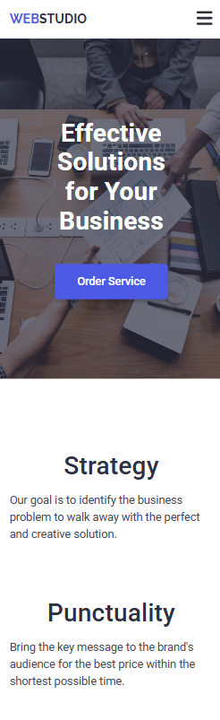

# 🌐 WebStudio Project — Responsive & Mobile Menu Implementation

This project was created as part of my **HTML & CSS homework (HW-06)**.  
The goal was to complete the **responsive layout**, **mobile menu**, and **min-resolution background images** requirements according to the Figma design.  
All pages were built following semantic HTML standards, accessibility rules, and mobile-first principles.

---

## 🚀 Live Demo

👉 [GitHub Pages Link](https://halenurgurel.github.io/goit-markup-hw-06/)

---

## 📂 Project Structure

```
goit-markup-hw-06/
│── index.html
│── styles.css
│── images/
│ ├── preview-mobile.png
│ ├── preview-tablet.png
│ ├── preview-desktop.png
│ ├── icons.svg
│ ├── hero-background.png
│ ├── hero-background@2x.png
│ ├── mark.png
│ ├── mark@2x.png
│ ├── tom.png
│ ├── tom@2x.png
│ ├── camila.png
│ ├── camila@2x.png
│ ├── daniel.png
│ ├── daniel@2x.png
│ ├── banking-app.png
│ ├── banking-app@2x.png
│ ├── cashless-payment.png
│ ├── cashless-payment@2x.png
│ ├── meditation-app.png
│ ├── meditation-app@2x.png
│ ├── taxi-service.png
│ ├── taxi-service@2x.png
│ ├── screen-illustrations.png
│ ├── screen-illustrations@2x.png
│ ├── online-courses.png
│ └── online-courses@2x.png
│── README.md

```

---

## ✅ Requirements Checklist

### 📱 Responsive Layout

| Requirement                                                              | Status |
| ------------------------------------------------------------------------ | ------ |
| – `<meta name="viewport">` added to `<head>`                             | ✅     |
| – Layout adjusted for 3 breakpoints: 320px, 768px, 1158px                | ✅     |
| – All bitmap images are responsive and support x1 & x2 densities         | ✅     |
| – Responsive backgrounds set with `min-resolution` media function        | ✅     |
| – Styles written using **Mobile First** approach with `min-width` MQs    | ✅     |
| – Styles limited to specific ranges using `min-width` and/or `max-width` | ✅     |
| – No redundant styles inside media queries                               | ✅     |

---

### 📖 Mobile Menu

| Requirement                                         | Status |
| --------------------------------------------------- | ------ |
| – All mobile menu items implemented                 | ✅     |
| – Mobile menu visually styled according to layout   | ✅     |
| – Menu width matches the viewport                   | ✅     |
| – Menu covers 100% of viewport height               | ✅     |
| – Menu hidden by default                            | ✅     |
| – Menu visible when `.is-open` class is added       | ✅     |
| Toggle button (`icon-menu`) opens menu              | ✅     |
| Close button (`icon-close`) hides menu              | ✅     |
| Menu and social icons included in mobile navigation | ✅     |

---

### 🧭 General Layout

| Section          | Implemented | Description                                           |
| ---------------- | ----------- | ----------------------------------------------------- |
| **Header**       | ✅          | Responsive navigation, logo, contact links            |
| **Hero**         | ✅          | Background image with gradient overlay and CTA button |
| **Features**     | ✅          | Four feature blocks, icons visible on desktop         |
| **Team**         | ✅          | Team grid with social media icons                     |
| **Portfolio**    | ✅          | Responsive cards with hover overlay                   |
| **Footer**       | ✅          | Newsletter subscription form and social links         |
| **Modal Window** | ✅          | Contact form with validation and checkbox             |

---

## 🧱 Semantic HTML & Accessibility

- Proper use of semantic elements: `header`, `main`, `section`, `nav`, `footer`
- Accessible navigation with `aria-label` attributes
- All SVG icons included via `<use href="./images/icons.svg#id"></use>`
- Inputs and checkboxes labeled with `<label>` for usability
- Contrast ratios and hover/focus states follow WCAG principles

---

## 🎨 Design & Responsiveness

| Device      | Screen Width | Layout Description                          |
| ----------- | ------------ | ------------------------------------------- |
| **Mobile**  | 320px–767px  | Collapsed mobile menu, single-column layout |
| **Tablet**  | 768px–1157px | Multi-column layout, menu visible           |
| **Desktop** | ≥1158px      | Full layout with grid and icons             |

---

## 🖼️ Visual Preview

| Mobile Layout                                  | Tablet Layout                                  | Desktop Layout                                   |
| ---------------------------------------------- | ---------------------------------------------- | ------------------------------------------------ |
|  |  |  |

---

## 🛠️ Tools & Technologies

| Tool / Technology                       | Purpose                   |
| --------------------------------------- | ------------------------- |
| **HTML5**                               | Semantic structure        |
| **CSS3 (Flexbox, Grid, Media Queries)** | Responsive design         |
| **Modern Normalize**                    | Cross-browser consistency |
| **Google Fonts (Roboto, Raleway)**      | Typography                |
| **SVG Sprites**                         | Vector-based icons        |
| **Prettier**                            | Code formatting           |
| **GitHub Pages**                        | Deployment                |

---

## ⚙️ Technical Notes

- Used **Mobile-First** approach with progressive enhancement.
- `min-resolution` used for retina background images.
- Navigation adapts automatically across breakpoints.
- `.is-open` class toggles mobile menu visibility.
- Hero section uses gradient overlay with `background: linear-gradient(...)`.
- All hover/focus effects use transitions for smooth interaction.
- Images optimized for performance and responsiveness.

---

## 👩‍💻 Author

**Halenur Gürel**  
Homework project – _Responsive Layout & Mobile Menu Implementation_  
📍 HTML5 · CSS3 · Responsive Design · Accessibility · SVG Sprite  
🔗 [GitHub Profile](https://github.com/halenurgurel)

---

> 🎯 _“This project demonstrates how to build a scalable and fully responsive website layout with semantic HTML and clean CSS architecture.”_
